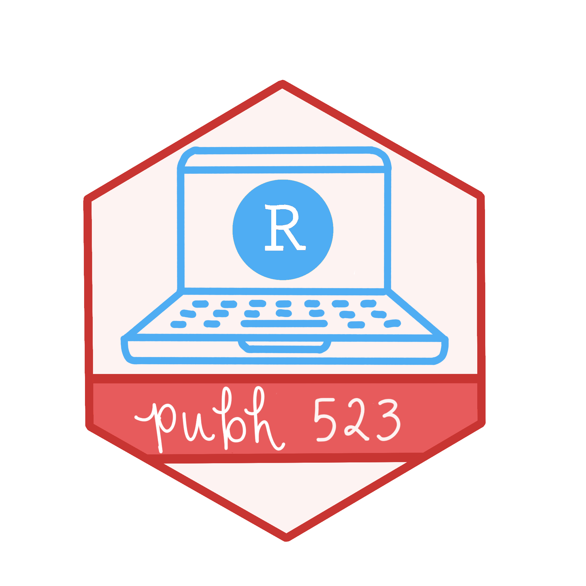

```{=html}
<style>
/* ---- Lesson color palette ---- */
:root {
  --blue: #5BAFF8;   --dark-blue: #3070BF;
  --pink: #EF85B3;   --pink2: #BF396F;
  --orange: #E75B5C; --red: #C83532;
  --green: #367B79;  --green2: #459B99;
  --ivory: #FDF3F2;
  --coral-text: #C44546;  /* darker coral so text stays readable */
}

/* ---- Welcome banner ---- */
.hero {
  background: linear-gradient(135deg, var(--dark-blue) 0%, #2A5FA3 100%);
  color: white;
  border-radius: 16px;
  padding: 2rem 2rem 1.5rem 2rem;
  margin-bottom: 1.5rem;
  align-items: center;
}
.hero h2 {
  color: white;
  border-bottom: none;
  margin-top: 0;
  font-size: 2.1rem;
  font-weight: 700;
}
.hero img { border-radius: 12px; }
.term-pill {
  display: inline-block;
  background-color: var(--blue);
  color: white;
  font-weight: 700;
  padding: 0.2em 0.9em;
  border-radius: 999px;
  margin-bottom: 0.75rem;
}
.hero-text { font-size: 1.08rem; line-height: 1.6; }

/* Buttons in the banner */
.hero-btn {
  display: inline-block;
  background-color: white;
  color: var(--dark-blue) !important;
  font-weight: 700;
  text-decoration: none;
  padding: 0.45em 1.1em;
  border-radius: 999px;
  margin: 0.25rem 0.4rem 0.25rem 0;
  border: 2px solid white;
}
.hero-btn:hover { background-color: transparent; color: white !important; }

/* ---- Info cards ---- */
.info-card {
  background-color: white;
  border: 1px solid #E9E4E2;
  border-top: 6px solid var(--card);
  border-radius: 12px;
  padding: 1rem 1.25rem 0.5rem 1.25rem;
  height: 100%;
  box-sizing: border-box;
}
.info-card h3 {
  color: var(--card-text);
  margin-top: 0.25rem;
  font-size: 1.25rem;
  font-weight: 700;
}
.info-card .icon { color: var(--card); }
.info-card p { margin-bottom: 0.6rem; }
.card-blue  { --card: var(--dark-blue); --card-text: var(--dark-blue); }
.card-green { --card: var(--green);     --card-text: var(--green); }
.card-coral { --card: var(--orange);    --card-text: var(--coral-text); }
.card-pink  { --card: var(--pink2);     --card-text: var(--pink2); }

.cards-band {
  background-color: var(--ivory);
  border-radius: 16px;
  padding: 1.5rem;
}

.source-link { text-align: right; color: #6C757D; }
</style>
```

::: {.grid .hero}
::: {.g-col-12 .g-col-md-4}
{fig-align="center" width="337"}
:::

::: {.g-col-12 .g-col-md-8}
## PUBH 523: Introduction to R

[Fall 2026]{.term-pill}

::: hero-text
This course provides an introduction to programming in R in public health, medicine, and related fields. Students will gain basic proficiency with the R environment and toolkit, focusing on reproducible workflows, data manipulation, visualization, and reporting. Topics include basic R programming, working in project-based folders, data transformations and summaries, data visualizations and plots, generating dynamic reports, and constructing summary tables. By the end of the course, students will be comfortable initiating data exploration projects in R and will be prepared to apply these skills in further analysis courses. **No prior statistical or coding experience is expected or required.**
:::

[OneDrive Folder](https://ohsuitg-my.sharepoint.com/:f:/r/personal/wakim_ohsu_edu/Documents/Teaching/Classes/PUBH_523_26Su/Student_files_PUBH_523_623?csf=1&web=1&e=81YRnr){.hero-btn} [Syllabus](syllabus.qmd){.hero-btn} [Schedule](schedule.qmd){.hero-btn} [Join Slack](https://join.slack.com/t/pubh523623/shared_invite/zt-40eg9bxpw-IW_2bAyq6SiXdn1q_tl2Yg){.hero-btn}
:::
:::

::: cards-band
::: grid
::: {.g-col-12 .g-col-md-4}
::: {.info-card .card-green}
### Instructor

[]{.icon} [Dr. Nicky Wakim](instructors.qmd)

[]{.icon} Vanport 622A

[]{.icon} [wakim\@ohsu.edu](mailto:wakim@ohsu.edu)
:::
:::

::: {.g-col-12 .g-col-md-4}
::: {.info-card .card-coral}
### Office Hours

**[Nicky](https://ohsu.webex.com/meet/wakim)**

[]{.icon} TBD

[]{.icon} TBD

**TA**

[]{.icon} TBD
:::
:::

::: {.g-col-12 .g-col-md-4}
::: {.info-card .card-pink}
### Contacting me

[]{.icon} E-mail or Slack is the best way to reach me. I try to respond to all course-related e-mails within 24 hours, Monday-Friday.
:::
:::
:::
:::

 

::: source-link
[ View the source on GitHub](https://github.com/nwakim/PUBH_523_26Su)
:::